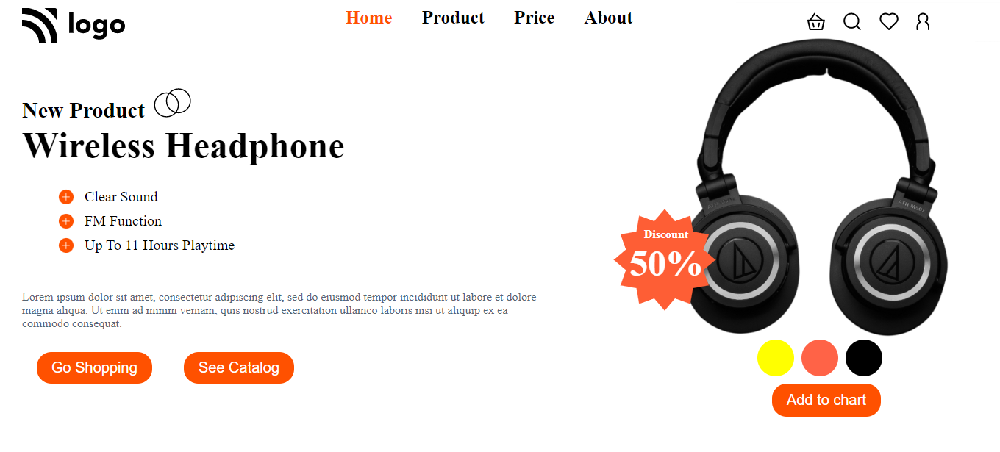

# Project 7 - HTML  and CSS 

> 
>
> By Naga Rajasekhar

You can find the live deployment link of this web page below

# [Live Deployment Link](https://headsetfirm.netlify.app/)

 
 

 

### Learnings from completing this project

1. Gained knowledge about postions and its properties 
2. Learnt about z-index
3. Gained knowledge about padding, margin, colors, border and their values

 

# It took around 5 hours to design this web page
